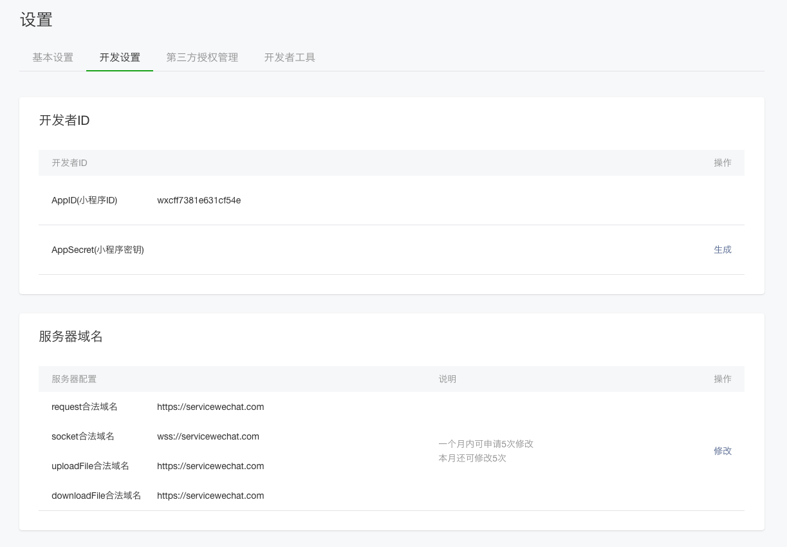

项目环境配置
============================

小程序开发工具配置
----------------------------

申请帐号
++++++++++++++++++++++++++++

进入小程序注册页 https://mp.weixin.qq.com/wxopen/waregister?action=step1 根据指引填写信息和提交相应的资料，就可以拥有自己的小程序帐号。

在这个小程序管理平台，你可以管理你的小程序的权限，查看数据报表，发布小程序等操作。

登录 小程序后台 ，我们可以在菜单 “开发”-“开发设置” 看到小程序的 AppID 了 。

    AppID界面
    

AppID是微信小程序云开发的基础。

安装开发工具
++++++++++++++++++++++++++++

前往 开发者工具下载页面 https://developers.weixin.qq.com/miniprogram/dev/devtools/download.html ，根据自己的操作系统下载对应的安装包进行安装，有关开发者工具更详细的介绍可以查看 《开发者工具介绍》<`https://developers.weixin.qq.com/miniprogram/dev/devtools/devtools.html`> 。

NodeJs环境配置
----------------------------

下载安装node.js
++++++++++++++++++++++++++++

官方下载地址: https://nodejs.org/en/ 下载LTS版本（长期稳定版本）

安装完成后输入命令行检测是否完成安装：

.. code-block:: bash

    node -v

配置环境变量
++++++++++++++++++++++++++++

配置全局安装的模块路径和缓存路径（不一定是安装路径）
在nodejs文件夹,创建 node_global
在nodejs文件夹,创建 node_cache
进入 “我的电脑”-右键-“属性”-“高级系统设置”-“高级”-“环境变量”
选择 系统变量 创建 NODE_PATH 变量

.. code-block:: bash

    set NODE_PATH=%USERPROFILE%\AppData\Roaming\npm\node_modules (安装的路径)

通过全局安装最常用的 express 模块 进行测试

.. code-block:: bash

    npm install express --save
    npm install -g express-generator
    express --version
    npm uninstall express

