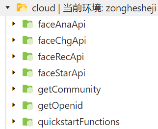
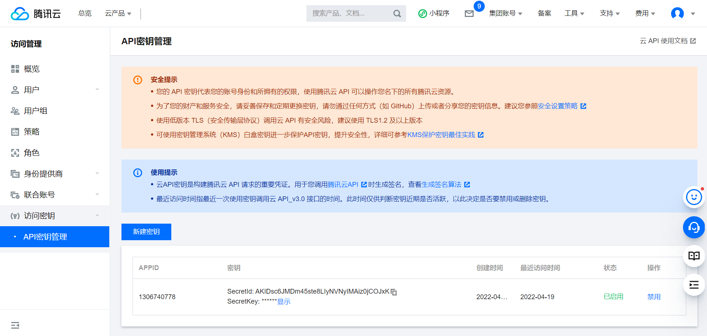

NodeJs后端实现
============================

在开通了小程序云开发服务的基础上，我们可以通过Node.js来实现后端服务。

首先需要新建一个与 **app.js** 同级别的文件夹，文件夹名为cloud，用于保存调用云数据库等等的函数 ，并在小程序项目的 **project.config.json** 文件内，更改如下代码

.. code-block::json
    :linenos:

    "cloudfunctionRoot": "cloud/",

保存后原本创建的文件夹会出现一个云的角标，点击进去可以看到，在这个文件夹下面可以创建各种云函数。

    云函数

通过右键cloud文件夹可以创建新的Node.js云函数,新建后可以在 **index.js** 中撰写基本逻辑

.. hint:: 保存更改后的index.js文件并不会立即生效，需要右键该文件并选择 **云函数增量上传：更新文件** 才会生效

人脸比对Node.js云函数实现
------------------------------

代码如下：

.. code-block:: javascript
    :linenos:
    
    const cloud = require('wx-server-sdk')
    // Depends on tencentcloud-sdk-nodejs version 4.0.3 or higher
    const tencentcloud = require("tencentcloud-sdk-nodejs");
    const IaiClient = tencentcloud.iai.v20200303.Client;
    cloud.init({
        env: cloud.DYNAMIC_CURRENT_ENV
    })

    // 云函数入口函数
    exports.main = async (event, context) => {
        try{
            const clientConfig = {
            credential: {
                secretId: "AKIDsc6JMDm45ste8LIyNVNyIMAiz0jCOJxK",
                secretKey: "8zZsuf9MJzOWOzIK6bpmRr0sSmpa4Ikv",
            },
            region: "ap-guangzhou",
            profile: {
                httpProfile: {
                endpoint: "iai.tencentcloudapi.com"
                }
            },
            };
            const client = new IaiClient(clientConfig);
            const params = {
            "UrlA": event.UrlA,
            "UrlB": event.UrlB
            };
            return await client.CompareFace(params)
        }catch(e){
            console.log(e);
        }
    
    }
    

在 NodeJS 中有一个方法是我们使用频率最高的，那就是 require 方法。NodeJs 遵循 CommonJS 规范，该规范的核心是通过 require来加载其他依赖的模块。

第一、三行代码中的 **wx-server-sdk** 和 **tencentcloud-sdk-nodejs** 是代码依赖，是微信官方为开发者封装的一套云开发工具包。开发过程中若出现了报错，可以尝试使用npm模块更新这两个包。

6~8行代码作用是初始化云环境，其中的 **env** 参数，可以选择 **DYNAMIC_CURRENT_ENV** 或者 **TENCENTCLOUD_RUNENV**，这两个参数都是微信官方提供的，可以通过微信小程序后台查看,目的都是在多个云环境中选择一个特定的云环境

第十行代码是函数入口， **clientConfig** 中的 **secretId** 和 **secretKey** 参数，是云开发的账号和密码，可以在云开发控制台查看。

    密钥
    

.. note:: 千万不要暴露自己的密钥，使用完成后就在工作台中禁用，防止流量泄露导致财产损失。    

    

**region** 参数是云开发地域参数，不同地区的服务器收费不一样，详情参考腾讯云收费标准。

**profile** 参数为接口请求域名，默认GET请求。

第24行代码用上述配置实例化了一个 **IaiClient** 对象，这个对象是核心对象，通过主函数中携带的 **event** 参数，可以获取到云函数传入的两张人脸图片参数。
并且两个Url均属于当前云环境下云数据库中的两张图片的下载地址。

.. hint:: 假如传入的是当前数据库的fileId，可以通过 **wx.cloud.getTempFileURL** 方法获取临时下载地址。否则后端将无法将图片转换为base64格式。

最后返回的是一个 **Promise** 对象，这个对象的结果是一个 **CompareFaceResponse** 类型的对象，这个对象中包含了人脸比对的结果。

.. hint:: 值得一提的是，await 关键字在此处十分重要，因为这个函数是一个异步函数，所以需要使用 await 关键字来等待结果返回。假如没有await，当函数执行至return处时，返回的是一个未执行完的Promise对象，而不是结果。该Promise对象会转至异步队列中，等待同步执行完毕，也就是return完成后才执行，正确的结果也就不复存在。

对于其他三种功能，只是参数以及配置的不同，差异不大，这里不再赘述

