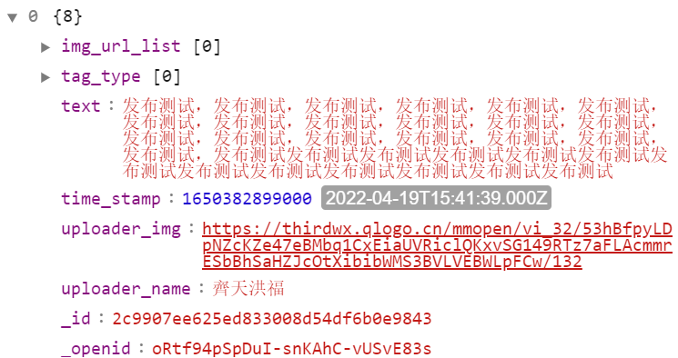

有关讨论区
=======================

页面布局
------------------------------

.. code-block:: wxml
    :linenos:

    <view class="card" wx:for="{{community_data}}" wx-for:index="index">
        <view class="user-info-time">
            <view class="user-img">
                <van-image round width="5vh" height="5vh" src="{{item.uploader_img}}" />
            </view>
            <view class="user-name-time">
                <view class="user-name">
                    {{item.uploader_name}}
                </view>
                <view class="time-date">
                    {{timeStamp2Date.toDate(item.time_stamp)}}
                </view>
            </view>
        </view>
        <view class="content-img" data-index="{{index}}" data-id="{{item._id}}" bindtap="naviToPage">
            <view class="content-container {{item.img_url_list.length==0?'':'has-image'}}">
                {{item.text}}
            </view>
            <block wx:if="{{item.img_url_list.length!=0}}">
                <view class="first-image-contaier">
                    <van-image width="20vw" height="20vw" src="{{item.img_url_list[0]}}" />
                </view>
            </block>
        </view>
        <van-divider borderColor="#00AEAE" hairline></van-divider>
    </view>

    <view class="publish-btn" hover-class="tap" bindtap="naviToPublish">
        <image src="/image/publish.png" style="width: 20vw;height: 20vw;scale: 0.7;"/>
    </view>

**wx:for="{{community_data}}"** 中的community_data是页面的数据，是一个对象数组，通过循环该数据达到页面渲染的效果。

定义的数据结构如下所示：

    数据结构

其中默认的 **wx:for-index** 是数组的索引， **wx:for-item** 是数组的元素。通过关键字 **item** 我们可以解构community_data中的数据，并通过获取对象元素的方式调用数据。
比如 **item.img_url_list[0]** 就是获取中第一个元素的图片地址，通过 **item.img_url_list.length** 是否为0来区分纯文字或者带图片的文字的布局。

获取讨论列表以及分页查询
------------------------------

新建Node.js云函数名称为 **getCommunity**,建立方式此处不再赘述，代码如下所示：

.. code-block:: javascript
    :linenos:

    // 云函数入口文件
    const cloud = require('wx-server-sdk')

    cloud.init({
        env: cloud.DYNAMIC_CURRENT_ENV
    })
    const db = cloud.database()
    const _ = db.command
    // 云函数入口函数
    exports.main = async (event, context) => {
        let skip_number = event.skip_number
        return await db.collection('communityData').orderBy('time_stamp', 'desc').field({
                '_id': true,
                '_openid': true,
                'text': true,
                'uploader_name': true,
                'uploader_img': true,
                'time_stamp':true,
                'tag_type':true,
                'img_url_list':true
            }).skip(skip_number).limit(8)
            .get()
            .then(res => {
                return res
            })
            .catch(err => {
                return err
            })
    }

**communityData** 是数据库中的保存讨论信息的集合名称，在云开发控制台中可以自定义，但是不能与其他集合重名。collection() 方法用于获取该集合的引用，返回一个集合的引用。

orderBy() 方法用于对集合进行排序，返回一个排序后的集合的引用。此处是根据时间戳进行降序排序， **desc** 可以更换成 **ascend** 以改变排序方式。

field() 方法用于设置返回集合中的字段，当一个数据库中存储字段过多时，可以使用该方法进行过滤，以减少时间开销。

.. hint:: 该方法内不能设置false，否则会报错。

limit() 方法用于限制返回集合中的元素个数。

skip() 方法用于跳过集合中的前 n 个元素，通过该方法可以实现分页查询。具体实现方法将在接下来展示。

页面生命周期函数Onload实现分页-1
------------------------------------

.. code-block:: javascript
    :linenos:

    onLoad: function (options) {
        let that = this
        wx.cloud.callFunction({
            name: 'getCommunity',
            data: {
                skip_number: 0
            },
            success: function (res) {
                // console.log(res);
                that.setData({
                    community_data: res.result.data
                })
                setTimeout(() => {
                    that.setData({
                        loading_state: false
                    })
                }, 500);
            },
            fail: function (err) {
                console.log(err);
            }
        })
    },

页面加载过程中，调用云函数获取讨论列表，并将数据渲染到页面中。

其中设置的参数 **skip_number** 默认为0，也就是跳过0个元素，也就是从第一个元素开始返回，返回长度为8.

页面周期函数OnReachBottom实现分页-2
------------------------------------

这个生命周期函数是在页面滚动到底部时触发的，但一般页面默认不允许滚动，所以我们要在当前文件同级目录下的json文件中配置允许滚动，如下所示：

.. code-block:: json
    :linenos:

    "enablePullDownRefresh": true

设置完成后，开始撰写js代码，如下所示：

.. code-block:: javascript
    :linenos:

    onReachBottom: function () {
        let that = this
        wx.showLoading({
            title: '加载中',
        })
        wx.cloud.callFunction({
            name: 'getCommunity',
            data: {
                skip_number: that.data.community_data.length
            },
            success: function (res) {
                // console.log(res);
                that.setData({
                    community_data: that.data.community_data.concat(res.result.data)
                })
                setTimeout(() => {
                    wx.hideLoading()
                }, 500);
            },
            fail: function (err) {
                console.log(err);
            }
        })
    },

通过传入skip_number的值，可以实现分页查询，每次查询8条数据，每次查询的起始位置为上次查询的末尾位置。

.. hint:: 优化提示：当页面中数据量较大时，采用上述方式进行页面渲染可能会导致页面开销很大，因为相当于重新刷新了整个界面，会导致页面的掉帧影响用户体验，有一种方式可以对页面数据进行局部调整，有兴趣可自行查阅

点击事件
------------------------

既然实现了分页查询，接下来面临的问题便是如何点击某个特定的元素从而进入其对应的详细界面呢

仔细看页面的wxml代码会发现， 有绑定一个点击函数 **bindtap="naviToPage"**

可以通过 **naviToPage** 点击事件的回调函数进行查询，代码如下所示：

.. code-block:: javascript
    :linenos:

    /**
     * 页面跳转
     * @param {*} e 点击回调
     */
    naviToPage: function (e) {
        // console.log(e);
        let _id = e.currentTarget.dataset.id
        wx.navigateTo({
            url: '/pages/pubdetailpage/pubdetailpage?_id=' + _id,
        })
    },

回看每个元素的数据结构，一个名为 **_id** 的变量便是区分不同元素的标识，通过回调对象e中的 **e.currentTarget.dataset.id** 便可以获取当前点击元素的_id，
进而通过url携带参数的形式跳转至详情页面。

在详情页面也就是 **pubdetailpage** 中,我们便可以根据我们的需求在页面周期函数 **Onload** 里根据携带的id参数进行数据库的查询，代码如下所示：

.. code-block:: javascript
    :linenos:

    onLoad: function (options) {
        let that=this
        wx.showLoading({
          title: '正在加载',
        })
        wx.cloud.database().collection('communityData').doc(options._id)
        .get()
        .then(res=>{
            // console.log(res);
            that.setData({
                detail_info:res.data
            })
            wx.hideLoading()
        }).catch(err=>{
            console.log(err);
            wx.hideLoading()
        })
    },

onLoad携带的参数 **options** ，可以接受上一个页面传过来的id进行查询。

