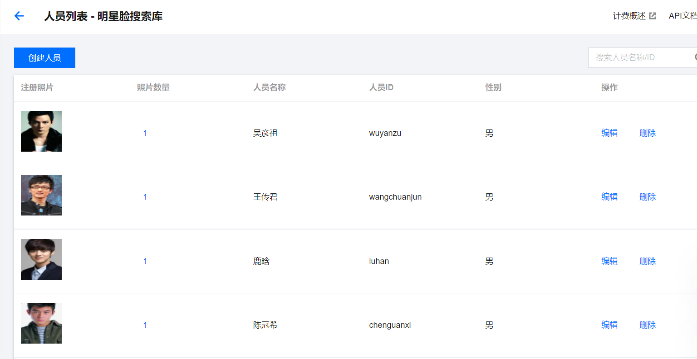

上传部分明星图片至人员库
===========================================================

上传图片至人员库以获取人员Id，返回前端再获取人员信息以减少结果上传再获取Url事件开销

.. code-block:: javascript
    :linenos:

    // Depends on tencentcloud-sdk-nodejs version 4.0.3 or higher
    const tencentcloud = require("tencentcloud-sdk-nodejs");

    const IaiClient = tencentcloud.iai.v20200303.Client;

    const clientConfig = {
    credential: {
        secretId: "SecretId",
        secretKey: "SecretKey",
    },
    region: "",
    profile: {
        httpProfile: {
        endpoint: "iai.tencentcloudapi.com",
        },
    },
    };

    const client = new IaiClient(clientConfig);
    const params = {
        "GroupId": "stars_face_library",
        "PersonName": "test",
        "PersonId": "test",
        "Gender": 0,
        "Url": "test"
    };
    client.CreatePerson(params).then(
    (data) => {
        console.log(data);
    },
    (err) => {
        console.error("error", err);
    }
    );

准备好人员库后，需要在云开发控制台手动上传40个相同的明星库图片以 **将人员id与人员库faceId相结合**

.. hint:: 腾讯云控制不支持循环批量导出，可以手动复制图片的下载id，也可写一个js脚本循环上传并获取下载链接形成json数据，由于数据量不大，本人采用前者

上传完成结果如下所示：

   上传结果

