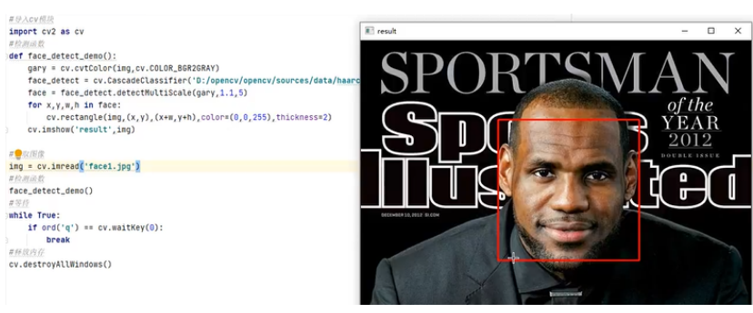
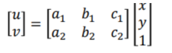
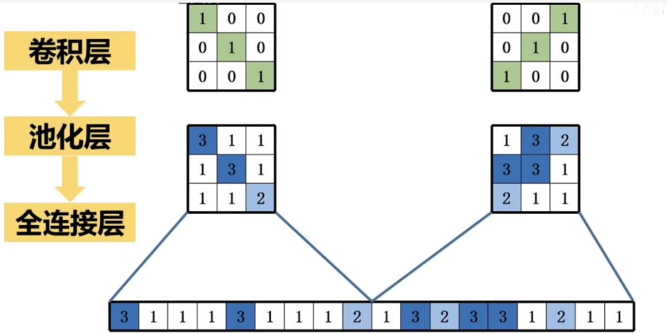

算法理论基础
============================

人脸识别
-------------------------------

深度学习具有特征自动学习， 泛化能力强和所学特征表现里强等优点， 因此深度学习在人脸识别问题上的应用极大的推动的人脸识别的发展。 但是深度学习也具有所需训练数据巨大、 训练耗时长和难于收敛等缺点。

    人脸目标检测

人脸对齐
-------------------------------

通过确定人脸中的标定点（landmark）的位置进行人脸对齐。（找3个点即可，一般找5个点：鼻子、眼睛、嘴角两端）对齐后可以找到一个二维坐标平面，进行下一步仿射变换

仿射变换
-------------------------------

原理:

- 二维坐标到二维坐标之间的线性变换
- 不共线的三对对应点决定了一个唯一的仿射变换

具体公式如下:

    仿射变换公式

人脸目标检测  
-------------------------------

使用神经网络（比如使用的DCNN）进行回归对标定点进行检测。

人脸特征提取
-------------------------------

    卷积神经网络

人脸区分
-------------------------------

人脸识别中的人脸验证问题即是验证两张图片是否来自同一个人。主要有欧氏距离和余弦距离方法，这是工业中常用的验证方法，首先假定两张人脸图片提取的特征向量为量为 xj→ 和 xk→ 。

欧氏距离差越大，相似度越小。

    欧氏距离

